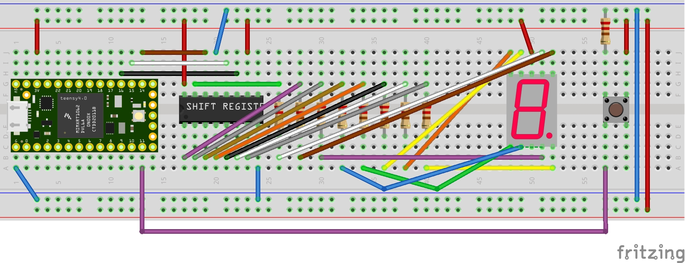

# Arduino-Digit-Match-Game
# Arduino Digit Matching Game

An interactive game built with Arduino that challenges players to match randomly generated digits using a push-button and a 7-segment display controlled via a shift register.    

 When the push-button is pressed, it records the current digit. After two presses, it compares the digits:
 
- If the digits match, the display blinks the matching number.
- If they do not match, the display shows a decimal point.

## Table of Contents
- [Introduction](#introduction)
- [Features](#features)
- [Components Required](#components-required)
- [Circuit Diagram](#circuit-diagram)
- [Installation](#installation)
- [How to Play](#how-to-play)
- [Code Explanation](#code-explanation)
- [Author](#Author)

## Introduction
This project implements a simple yet engaging digit-matching game using an Arduino, a 7-segment display, a 74HC595 shift register, and a push-button. The game generates random digits, and the player must try to capture matching digits by pressing the button at the right time. It's a fun way to get familiar with shift registers, 7-segment displays, and debouncing techniques in Arduino.

## Features
- **Random Digit Generation**: Displays a new random digit every 500 milliseconds.
- **Push-Button Interaction**: Capture digits by pressing a button.
- **Match Detection**: Checks if two consecutively captured digits match.
- **Visual Feedback**:
    - **Match**: The matching digit blinks on the display.
    - **No Match**: The decimal point lights up.
- **Round Tracking**: Keeps count of the number of rounds played.
- **Debounced Input**: Utilizes the Bounce2 library for reliable button presses.

## Components Required
- Teensy 4.2 (or Arduino compatible board)
- 7-Segment Display
- 74HC595 Shift Register
- Push-Button Switch
- Resistors:
    - 220Ω resistors for the 7-segment display segments
    - 10kΩ resistor for the push-button pull-down
- Breadboard and Jumper Wires

## Circuit Diagram
**Note**: Please refer to the `Teensy_ShiftRegister_7Segment_Wiring` image in the repository for wiring instructions.

## Demo Video

https://github.com/user-attachments/assets/24ef1d5b-7839-4ed9-bf69-5a74498b7cdf

## Installation

### Install the Required Libraries:
1. Open the Arduino IDE.
2. Go to `Sketch > Include Library > Manage Libraries...`.
3. Search for `Bounce2` and install it.

### Open the Project:
1. Open `DigitMatchingGame.ino` in the Arduino IDE.

### Connect the Hardware:
1. Wire the components as per the circuit diagram.

### Upload the Code:
1. Select the correct board and port under `Tools`.
2. Click the `Upload` button.

## How to Play
### Start the Game:
- Once the Arduino is powered on, the game begins automatically.
- The 7-segment display will start showing random digits every 500 milliseconds.

### Capture Digits:
1. Press the push-button to capture the current digit on display.
2. The first press captures the first digit.
3. The second press captures the second digit.

### Check for a Match:
- If the two captured digits match:
    - The digit will blink on the display.
    - A message => **MATCH** will appear in the Serial Monitor.
- If they do not match:
    - The decimal point on the display will light up.
    - A message => **NO Match...** will appear in the Serial Monitor.

### Proceed to Next Round:
- After displaying the result, the game automatically proceeds to the next round.
- The round number increments, and you can try again.

## Code Explanation
### Libraries Used:
- `Bounce2.h`: Handles debouncing of the push-button input.
- `Arduino.h`: Standard Arduino functions and definitions.

### Pin Definitions:
- `dataPin`: Connected to DS (Serial Data Input) of the shift register.
- `latchPin`: Connected to ST_CP (Storage Register Clock Input) of the shift register.
- `clockPin`: Connected to SH_CP (Shift Register Clock Input) of the shift register.
- `BUTTON_PIN`: Connected to one leg of the push-button.

### Global Variables:
- `pressNumber`: Counts the number of button presses in the current round.
- `firstDigit` & `secondDigit`: Store the digits captured by the player.
- `roundNumber`: Tracks the current round number.
- `digits[]`: Byte patterns corresponding to the segments for digits 0-9 on the 7-segment display.

### Setup Function:
- Initializes the pin modes.
- Attaches and configures the button using Bounce2.
- Prints the starting round to the Serial Monitor.

### Main Loop:
- Updates the button state.
- Generates a random digit and displays it.
- Checks for button presses and handles digit capturing.
- Calls `checkMatch()` after two presses.

### Functions:
- `displayDigit(int digit)`: Displays a single digit on the 7-segment display.
- `blinkDigit(int digit)`: Blinks the matching digit to provide visual feedback.
- `clearDisplay()`: Clears the display by turning off all segments.
- `showDecimalPoint()`: Lights up only the decimal point to indicate no match.
- `checkMatch()`: Compares the two captured digits and triggers appropriate feedback.

## Author
[Chengkuan](https://github.com/chengkuanz)

last update: 2024 November
